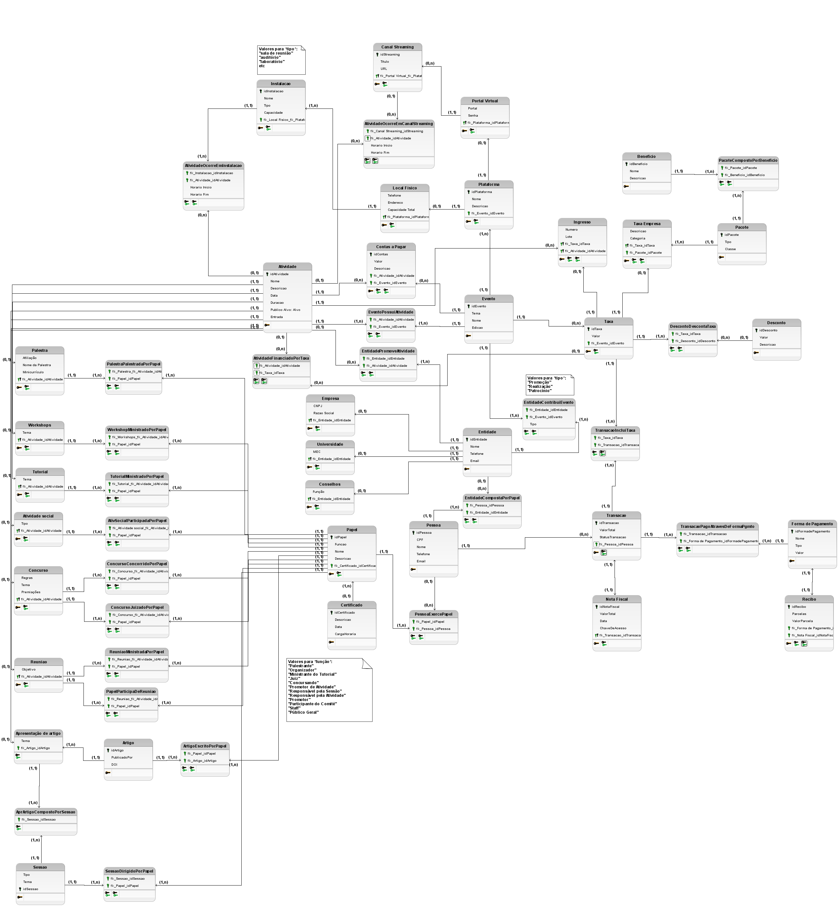

# bd-events

## Tarefas

- [X] Modelo completo em PDF ou PNG, incluindo extensão.
- [X] Extensão do documento de especificação de requisitos (PDF).
- [ ] Modelo lógico relacional, incluindo extensão.
- [ ] Backup do banco de dados usando a ferramenta de backup do SGBD.
- [ ] Script SQL com os comandos DDL de criação de esquema completo do BD.
- [ ] Comandos DML de inserção de dados nas tabelas.
- [ ] Cada consulta com o seu enunciado e resolução em SQL deve estar em um arquivo TXT conforme solicitado na especificação do trabalho.
- [ ] Consulta em vídeo.
- [ ] CRUD.

## Modelo

Ver [doc do modelo no Drive](https://docs.google.com/document/d/1HVbvhmeU4S9CP4tawIv26YNqxctOHQtZs9GzsLNgihc/edit).

Ver [doc pra texto do vídeo](https://docs.google.com/document/d/10kPLFgWmMAa-z3QAwuUaqE2eO_oXaWq9uaw5b38GfHg/edit).

